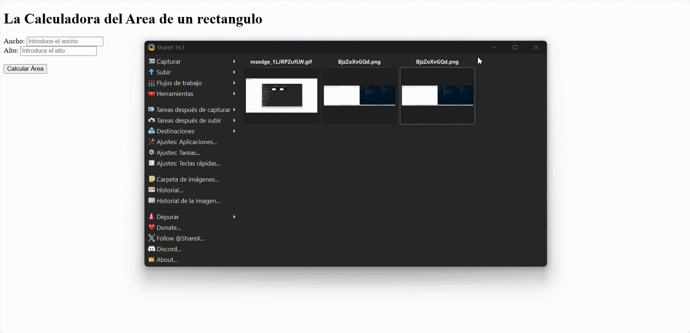
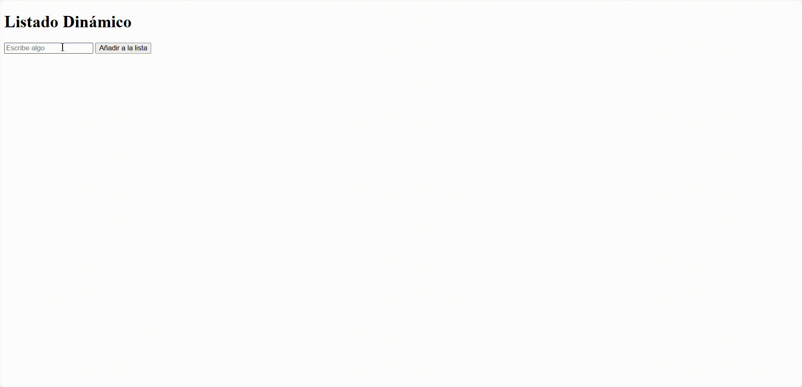
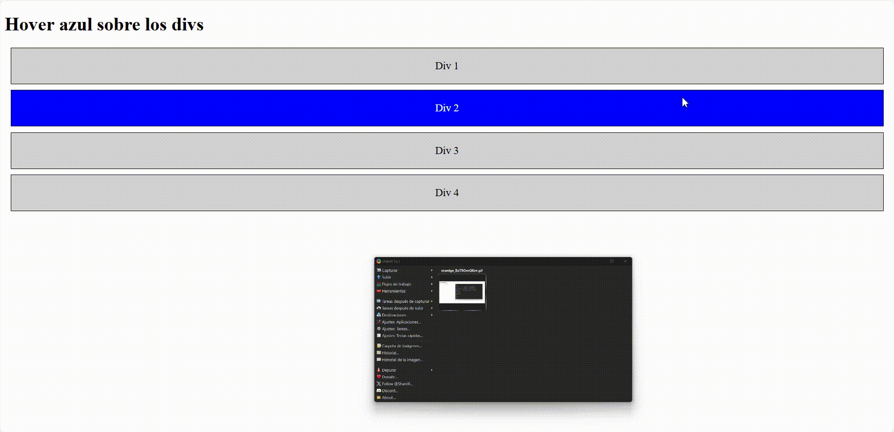

# Boletín de Ejercicios Web

Este repositorio contiene cuatro ejercicios de desarrollo web. A continuación, se presenta un análisis detallado, el diseño de la solución, la implementación y las pruebas correspondientes para cada ejercicio.

## Ejercicio 1: Cambio de Color con Botón

### Análisis del problema
Se debe crear una página web que contenga un botón etiquetado "Cambiar color". Al hacer clic en este botón, el color de fondo de la página debe cambiar a un color generado aleatoriamente. Este problema se resolverá utilizando el método `Math.random()` para generar valores RGB aleatorios.

### Diseño de la propuesta de solución del problema
- **Esquema gráfico**: Diagrama de flujo que muestra el proceso de generación de color.
  
### Implementación del diseño propuesto
Se implementará la solución utilizando HTML y JavaScript para cambiar el color de fondo de la página.

### Pruebas de la resolución del problema
Se realizarán pruebas para verificar que el color de fondo cambia de manera aleatoria al hacer clic en el botón.

---

## Ejercicio 2: Calculadora de Área

### Análisis del problema
Se requiere diseñar una página web con dos campos de entrada para introducir el ancho y el alto de un rectángulo. Al hacer clic en un botón etiquetado "Calcular Área", el área del rectángulo se debe calcular y mostrar en un párrafo en la página.

### Diseño de la propuesta de solución del problema
- **Esquema gráfico**: Diagrama de flujo que muestra el proceso de cálculo del área.
  
### Implementación del diseño propuesto
Se utilizarán formularios HTML y un script JavaScript para realizar los cálculos y mostrar el resultado.

### Pruebas de la resolución del problema
Se probarán diferentes valores de ancho y alto para asegurar que el área se calcula y se muestra correctamente.

---

## Ejercicio 3: Listado Dinámico

### Análisis del problema
Se necesita una página con un campo de entrada y un botón etiquetado "Añadir a la lista". Al hacer clic en el botón, el contenido del campo debe añadirse como un nuevo ítem (`<li>`) a una lista vacía (`<ul>`).

### Diseño de la propuesta de solución del problema
- **Esquema gráfico**: Diagrama de flujo que muestra el proceso de añadir ítems a la lista.
  
### Implementación del diseño propuesto
Se utilizará JavaScript para crear y añadir elementos a la lista en el DOM.

### Pruebas de la resolución del problema
Se verificarán que los ítems se añaden correctamente a la lista y que no se permiten entradas vacías.

---

## Ejercicio 4: Hover y Estilo Dinámico

### Análisis del problema
El objetivo es crear una página con varios elementos `div`. Al pasar el ratón sobre un `div`, su color de fondo debe cambiar a azul y el texto a blanco. Al mover el ratón fuera del `div`, los estilos originales deben restaurarse.

### Diseño de la propuesta de solución del problema
- **Esquema gráfico**: Diagrama de flujo que muestra el proceso de gestión de eventos para cambiar estilos.
  
### Implementación del diseño propuesto
Se utilizarán eventos en JavaScript para gestionar los cambios de estilo de los `div`.

### Pruebas de la resolución del problema
Se realizarán pruebas para verificar que los estilos cambian correctamente al pasar el ratón sobre los elementos y se restauran al salir.

