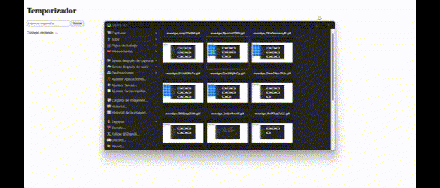

# Boletín de Ejercicios Web

Este repositorio contiene cuatro ejercicios de desarrollo web. A continuación, se presenta un análisis detallado, el diseño de la solución, la implementación y las pruebas correspondientes para cada ejercicio.

## Ejercicio 1: Contrarreloj

### Análisis del problema
Se debe crear una página web que contenga un botón etiquetado "Cambiar color". Al hacer clic en este botón, el color de fondo de la página debe cambiar a un color generado aleatoriamente. Este problema se resolverá utilizando el método `Math.random()` para generar valores RGB aleatorios.

### Diseño de la propuesta de solución del problema
- **Esquema gráfico**: Diagrama de flujo que muestra el proceso de generación de color.
  
### Implementación del diseño propuesto
Se implementará la solución utilizando HTML y JavaScript para cambiar el color de fondo de la página.

### Pruebas de la resolución del problema
Se realizarán pruebas para verificar que el color de fondo cambia de manera aleatoria al hacer clic en el botón.

---

## Ejercicio 2: Calculadora básica

### Análisis del problema
Se requiere diseñar una página web con dos campos de entrada para introducir el ancho y el alto de un rectángulo. Al hacer clic en un botón etiquetado "Calcular Área", el área del rectángulo se debe calcular y mostrar en un párrafo en la página.

### Diseño de la propuesta de solución del problema
- **Esquema gráfico**: Diagrama de flujo que muestra el proceso de cálculo del área.
  
### Implementación del diseño propuesto
Se utilizarán formularios HTML y un script JavaScript para realizar los cálculos y mostrar el resultado.

### Pruebas de la resolución del problema
Se probarán diferentes valores de ancho y alto para asegurar que el área se calcula y se muestra correctamente.

.gif)

.gif)

%20(1).gif)

---

## Ejercicio 3: Encuesta con gráficos de resultados

### Análisis del problema
Se necesita una página con un campo de entrada y un botón etiquetado "Añadir a la lista". Al hacer clic en el botón, el contenido del campo debe añadirse como un nuevo ítem (`<li>`) a una lista vacía (`<ul>`).

### Diseño de la propuesta de solución del problema
- **Esquema gráfico**: Diagrama de flujo que muestra el proceso de añadir ítems a la lista.
  
### Implementación del diseño propuesto
Se utilizará JavaScript para crear y añadir elementos a la lista en el DOM.

### Pruebas de la resolución del problema
Se verificarán que los ítems se añaden correctamente a la lista y que no se permiten entradas vacías.

---

## Ejercicio 4: Cronómetro con controles de inicio , pausa y reinicio

### Análisis del problema
El objetivo es crear una página con varios elementos `div`. Al pasar el ratón sobre un `div`, su color de fondo debe cambiar a azul y el texto a blanco. Al mover el ratón fuera del `div`, los estilos originales deben restaurarse.

### Diseño de la propuesta de solución del problema
- **Esquema gráfico**: Diagrama de flujo que muestra el proceso de gestión de eventos para cambiar estilos.
  
### Implementación del diseño propuesto
Se utilizarán eventos en JavaScript para gestionar los cambios de estilo de los `div`.

### Pruebas de la resolución del problema
Se realizarán pruebas para verificar que los estilos cambian correctamente al pasar el ratón sobre los elementos y se restauran al salir.

## Ejercicio 5: Juego de memoria con cartas

### Descripción
El objetivo es crear un juego de memoria donde el usuario debe hacer clic en dos cartas para ver si coinciden. Si coinciden, permanecen boca arriba; si no, se voltean después de un breve intervalo. El objetivo es encontrar todas las parejas.

### Diseño de la propuesta de solución del problema
- **HTML**: Crear una cuadrícula de cartas (pueden ser imágenes o texto como números o letras).
- **JS**: Detectar el evento `click` en cada carta. Implementar lógica condicional para comparar cartas seleccionadas y usar `setTimeout` para manejar el volteo de cartas que no coinciden.
- **Manipulación del DOM**: Mostrar/ocultar cartas y actualizar el estado del juego dinámicamente.
  
### Implementación del diseño propuesto
Se utilizarán eventos de clic y métodos de temporización (`setTimeout`) para gestionar el volteo de cartas. La lógica debe manejar la comparación de cartas seleccionadas, asegurando que el juego detecte cuando todas las parejas han sido encontradas, y mostrando un mensaje de finalización. El juego debe reiniciarse correctamente, barajando las cartas.

### Pruebas de la resolución del problema
Se realizarán las siguientes pruebas para verificar el funcionamiento del juego:
1. Verificar que las cartas se voltean al hacer clic y permanecen boca arriba si coinciden.
2. Comprobar que dos cartas no coincidentes se voltean nuevamente tras un breve intervalo.
3. Probar que el juego detecta cuando se han encontrado todas las parejas y muestra un mensaje de finalización.
4. Verificar que el juego puede reiniciarse correctamente, barajando las cartas de nuevo.

