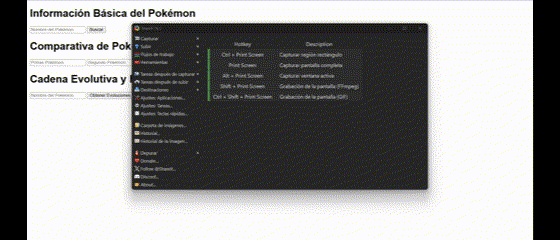
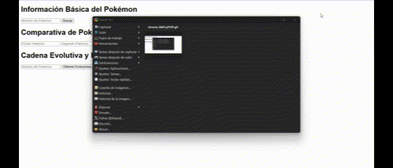
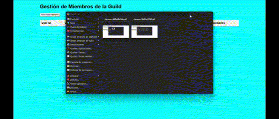
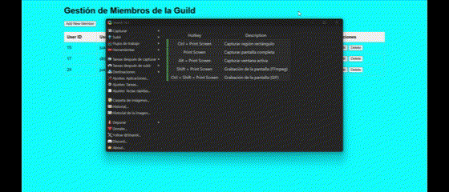
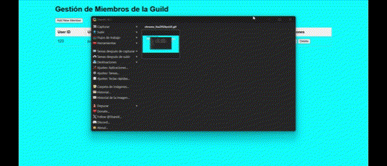
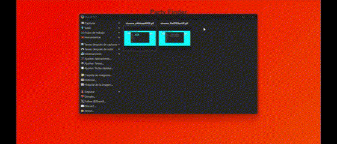

# Fases de la Resolución de Problemas

## Análisis del Problema
Especificación clara y sin ambigüedades del problema a resolver.

## Diseño de la Propuesta de Solución del Problema
Diseño de una o varias soluciones usando herramientas como diagramas de flujo, UML, entre otros.

## Implementación del Diseño Propuesto
Implementación del diseño desarrollado en el paso anterior.

## Pruebas de la Resolución del Problema
Pruebas para asegurar el funcionamiento correcto de la implementación, comparando el comportamiento obtenido con el esperado.

---

# Ejercicio 1: Análisis y Transformación Avanzada de Datos

### Análisis del Problema
Se tiene un conjunto de datos de estudiantes que contiene información como calificaciones y ciudad. Se requiere implementar varias funciones que permitan analizar, filtrar y transformar estos datos de forma avanzada, para realizar cálculos como promedio de calificaciones, lista de estudiantes destacados y mejora de notas para ciertos estudiantes.

### Diseño de la Propuesta de Solución del Problema
El diseño incluye varias funciones en JavaScript:
- Una función para obtener los 3 estudiantes con mejores calificaciones en una asignatura.
- Otra función para identificar la asignatura con menor rendimiento promedio.
- Una función para aumentar las notas de estudiantes con beca.
- Funciones para filtrar estudiantes por ciudad y asignatura, y para contar estudiantes sin beca en una ciudad específica.

### Implementación del Diseño Propuesto
Se desarrollan las funciones en JavaScript siguiendo la lógica definida en el diseño, aplicando iteraciones y cálculos para filtrar y ordenar los datos. Se usa manipulación de arrays y objetos para lograr la transformación de datos.

### Pruebas de la Resolución del Problema
Se realizan pruebas unitarias y de integración para verificar que cada función devuelve los resultados esperados. Se comparan los resultados con casos de prueba definidos y se depura cualquier comportamiento anómalo.

---

# Ejercicio 2: Uso de PokeAPI

### Análisis del Problema
Se requiere una aplicación que interactúe con la PokeAPI para obtener información sobre Pokémon. Debe permitir al usuario:
1. Consultar información básica de un Pokémon.
2. Comparar las estadísticas base entre dos Pokémon seleccionados.
3. Consultar la cadena evolutiva y habilidades de un Pokémon.

### Diseño de la Propuesta de Solución del Problema
El diseño incluye:
- Funciones para hacer solicitudes a la API y obtener datos básicos, habilidades y evoluciones de Pokémon.
- Mecanismos para mostrar los resultados en una interfaz gráfica y presentar la comparación de estadísticas en una tabla.

### Implementación del Diseño Propuesto
Se utilizan peticiones `fetch` para interactuar con la API, y se desarrollan funciones que manejan la obtención de datos y actualizan el DOM para mostrar resultados al usuario.

### Pruebas de la Resolución del Problema
Se realizan pruebas de interfaz y funcionalidad. Se verifica que la API responde correctamente y que los datos se muestran de forma precisa. Se prueban casos con Pokémon válidos e inválidos para garantizar la robustez del código.

---

# Ejercicio 3: Implementación de CRUD con Modal para "Add New Member" en una Guild

### Análisis del Problema
Necesitamos una funcionalidad CRUD para gestionar los miembros de una guild. Esto incluye añadir, editar y eliminar miembros, con validaciones y confirmación en cada acción. Se espera que el sistema gestione los miembros en una tabla y que el modal permita añadir y editar datos.

### Diseño de la Propuesta de Solución del Problema
El diseño incluye:
- Una tabla para mostrar los miembros de la guild.
- Un modal que permita añadir y editar miembros, con campos obligatorios y validación.
- Funciones para eliminar miembros con confirmación de eliminación.

### Implementación del Diseño Propuesto
Se implementan las funciones CRUD con manejo de modales para añadir y editar miembros. La lógica de validación se aplica antes de añadir o actualizar datos en la tabla.

### Pruebas de la Resolución del Problema
Se realizan pruebas de interfaz y funcionalidad para asegurar que el modal se despliega correctamente y que las operaciones de añadir, editar y eliminar funcionan como se espera, respetando las validaciones y confirmaciones.

---

# Ejercicio 4: Encuesta con Gráficos de Resultados

### Análisis del Problema
Se requiere una página con una encuesta que permita al usuario seleccionar una opción. Al enviar la respuesta, los resultados deben visualizarse en un gráfico de barras, que refleje la cantidad de votos acumulados para cada opción.

### Diseño de la Propuesta de Solución del Problema
El diseño propone:
- Una estructura HTML que contenga la encuesta con varias opciones.
- Un gráfico de barras para visualizar los resultados, actualizado con manipulación del DOM.
- Funciones para manejar el evento de envío de respuesta y contabilizar los votos.

### Implementación del Diseño Propuesto
Se implementa un formulario con opciones de encuesta y un gráfico de barras que refleja los votos en tiempo real. Las funciones en JavaScript controlan el evento de envío y actualizan el gráfico con los nuevos valores.

### Pruebas de la Resolución del Problema
Se prueban las interacciones de usuario para verificar que los votos se cuentan correctamente y que el gráfico se actualiza en tiempo real. Se comprueba también el comportamiento de la encuesta en distintos navegadores.

---

# Ejercicio 5: Juego de Memoria con Cartas

### Análisis del Problema
Se necesita crear un juego de memoria donde el usuario debe encontrar parejas de cartas. Al hacer clic en una carta, esta se voltea; si el usuario selecciona dos cartas diferentes, ambas se voltean de nuevo después de un breve intervalo. Las cartas iguales deben permanecer visibles.

### Diseño de la Propuesta de Solución del Problema
Se diseña la interfaz del juego con una cuadrícula de cartas. El diseño incluye:
- Funcionalidad para voltear cartas al hacer clic.
- Comparación de cartas y temporización para el volteo en caso de no coincidencia.
- Lógica para mantener las cartas iguales visibles y reiniciar el juego al final.

### Implementación del Diseño Propuesto
Se implementan eventos de clic para voltear cartas y se utiliza `setTimeout` para manejar el intervalo de volteo en caso de no coincidencia. La lógica compara cartas y mantiene visibles las parejas coincidentes.

### Pruebas de la Resolución del Problema
Se realizan pruebas de juego para verificar que las cartas coincidentes permanecen visibles y que el volteo funciona como se espera. Además, se prueba el reinicio del juego y la correcta interacción con los elementos.
