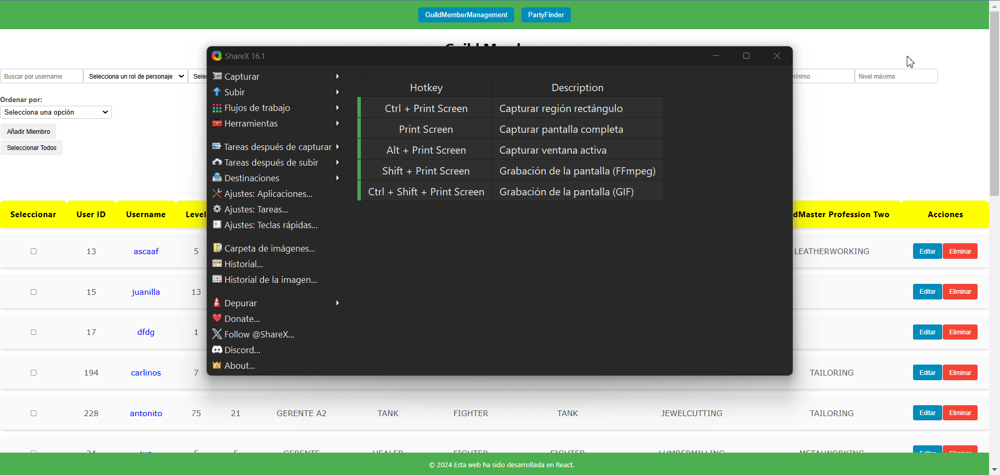
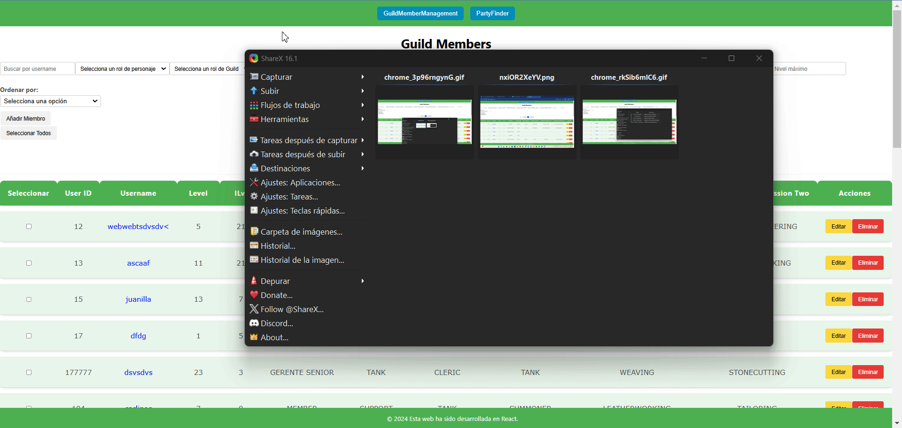
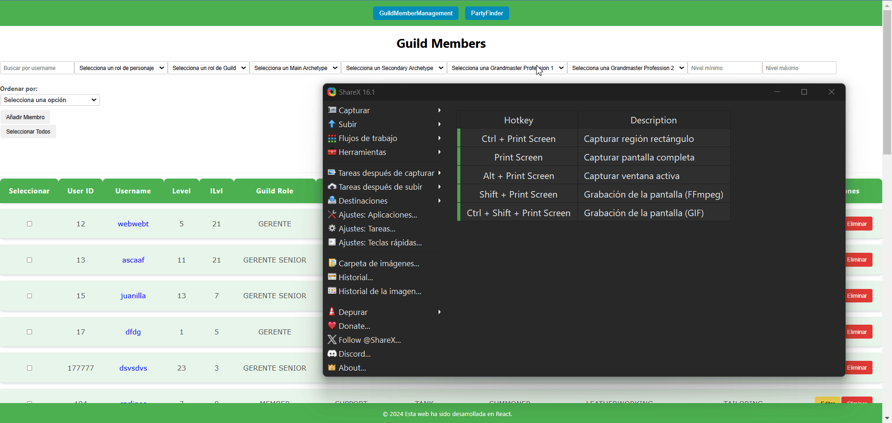
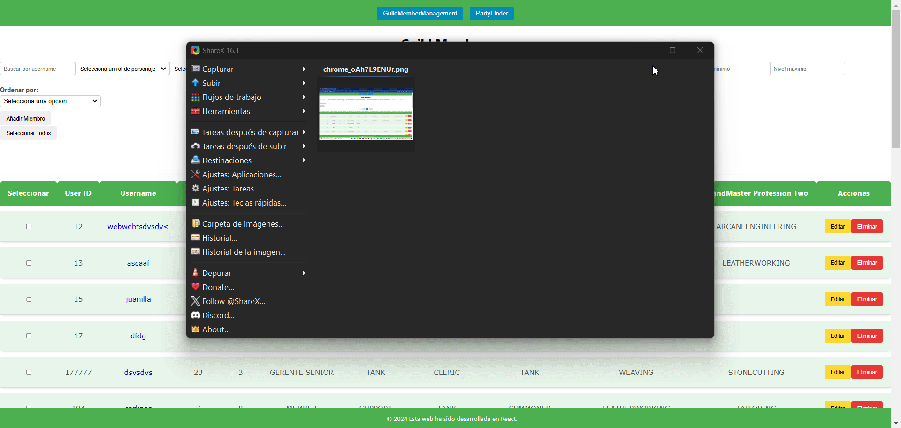
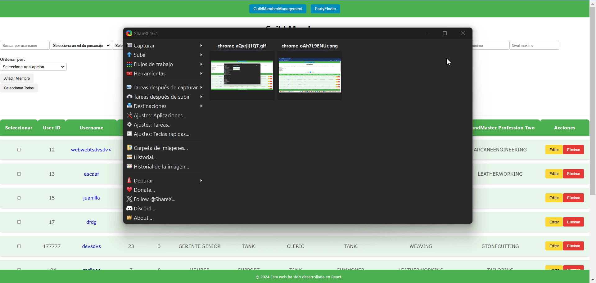

# Ejercicios de Desarrollo Web

## Ejercicio 1: Panel Avanzado de Gestión de Miembros del Gremio

### Contexto:
Este ejercicio se centra en ampliar y mejorar el sistema de gestión de miembros del gremio previamente desarrollado. El objetivo es crear un Panel de Gestión de Miembros más avanzado que permita funcionalidades adicionales como filtrado, ordenación, selección múltiple y acciones en lote, proporcionando una interfaz más robusta y eficiente para gestionar los miembros del gremio.

### Requisitos Funcionales:
1. **Visualización Avanzada de Miembros**:
   - **Tabla de Miembros**:
     - Mostrar todos los miembros del gremio en una tabla dinámica.
     - Incluir las siguientes columnas:
       - `user_id` (entero) (esto es único)
       - `username` (cadena)
       - `level` (entero)
       - `ilvl` (entero)
       - `character_role` (enum: TANK, HEALER, DAMAGE, SUPPORT)
       - `guild_role` (enum: LEADER, SENIOR MANAGER, MANAGER, MANAGER A2, ALPHA 2, MEMBER)
       - `main_archetype` (enum: BARD, CLERIC, FIGHTER, MAGE, RANGER, ROGUE, SUMMONER, TANK)
       - `secondary_archetype` (enum: BARD, CLERIC, FIGHTER, MAGE, RANGER, ROGUE, SUMMONER, TANK)
       - `grandmaster_profession_one` (enum: FISHING, HERBALISM, HUNTING, LUMBERJACKING, MINING, ALCHEMY, ANIMALHUSBANDRY, COOKING, FARMING, LUMBERMILLING, METALWORKING, STONECUTTING, TANNING, WEAVING, ARCANEENGINEERING, ARMORSMITHING, CARPENTRY, JEWELCUTTING, LEATHERWORKING, SCRIBE, TAILORING, WEAPONSMITHING)
       - `grandmaster_profession_two` (enum: FISHING, HERBALISM, HUNTING, LUMBERJACKING, MINING, ALCHEMY, ANIMALHUSBANDRY, COOKING, FARMING, LUMBERMILLING, METALWORKING, STONECUTTING, TANNING, WEAVING, ARCANEENGINEERING, ARMORSMITHING, CARPENTRY, JEWELCUTTING, LEATHERWORKING, SCRIBE, TAILORING, WEAPONSMITHING)
     - Añadir una columna con una casilla de verificación para seleccionar miembros.
     - Cada fila debe tener botones de Editar y Eliminar.

2. **Filtrado y Ordenación**:
   - **Barra de Filtro** que permita filtrar miembros por:
     - Rol de Personaje
     - Rol en el Gremio
     - Arquetipo Principal
     - Arquetipo Secundario
     - Profesión de Gran Maestro (ambas 1 y 2)
     - Nivel mínimo y máximo
     - Nivel de objeto mínimo y máximo
   - Los filtros deben ser combinables (por ejemplo, filtrar por Rol de Personaje y Nivel mínimo).
   - **Ordenación**:
     - Permitir ordenar la tabla por cualquiera de las columnas, tanto ascendente como descendente.

3. **Selección Múltiple y Acciones en Lote**:
   - **Selección Múltiple**:
     - Los usuarios pueden seleccionar múltiples miembros usando casillas de verificación.
     - Añadir una casilla de verificación en el encabezado para seleccionar/deseleccionar todos los miembros visibles.
   - **Acciones en Lote**:
     - Cambiar Rol en el Gremio: Permite cambiar el rol en el gremio de todos los miembros seleccionados a un rol específico.
     - Eliminar Miembros: Permite eliminar todos los miembros seleccionados (requiere confirmación en una alerta).

4. **Optimización**:
   - **Renderizado Eficiente**:
     - Implementar técnicas para evitar renderizados innecesarios, mejorando el rendimiento con grandes cantidades de datos.
     - Usar `React.memo`, `useMemo`, y `useCallback` donde sea apropiado.
   - **Paginación**:
     - Implementar paginación de la lista para manejar eficientemente listas con muchos miembros.
     - Añadir un selector para decidir si mostrar 10, 20 o 50 miembros.

5. **Detalles y Edición de Miembros**:
   - **Detalle de Miembro**:
     - Hacer clic en el Nombre de Usuario de un miembro abre un Modal con detalles completos del miembro.
   - **Edición Mejorada**:
     - El modal de edición debe permitir actualizar todos los campos del miembro excepto `user_id`.
     - Implementar validaciones avanzadas:
       - Asegurarse de que los niveles (Nivel e ilvl) sean enteros positivos.
       - Evitar duplicados en `user_id`.

6. **Validaciones y Manejo de Errores**:
   - **Validaciones en Tiempo Real**:
     - Mostrar mensajes de error mientras el usuario completa los formularios si los datos son inválidos.
     - Deshabilitar el botón de envío hasta que el formulario sea válido.
   - **Manejo de Errores de API**:
     - Mostrar mensajes de error claros si hay un problema al comunicarse con la API.
     - Manejar errores comunes como fallos de red o códigos de respuesta de error.

### Pruebas de Resolución de Problemas:
1. **Prueba 1: Filtrado Combinado con Ordenación y Acciones en Lote**
   - Aplicar múltiples filtros simultáneamente (por ejemplo, Rol de Personaje = 'DAMAGE', Rol en el Gremio = 'MEMBER', Nivel entre 50 y 60, Arquetipo Principal = 'MAGE', Profesión de Gran Maestro Uno = 'ALCHEMY').
   - Ordenar los resultados por ilvl en orden descendente.
   - Seleccionar todos los miembros filtrados usando la casilla de verificación en el encabezado.
   - Realizar una acción en lote para cambiar su Rol en el Gremio a 'MANAGER'.
   - Verificar que solo los miembros visibles y filtrados se actualicen correctamente y que la paginación refleje los cambios.
     ---
     

2. **Prueba 2: Edición de Miembros con Validación en Tiempo Real y Manejo de Errores de API**
   - Editar un miembro desde el MemberEditModal e ingresar valores inválidos (por ejemplo, Nivel negativo, ilvl no numérico).
   - Comprobar que las validaciones en tiempo real impiden el envío y muestran mensajes de error claros.
   - Simular un fallo de API al guardar cambios válidos y verificar que el NotificationSystem informe adecuadamente sin afectar la usabilidad.
    

3. **Prueba 3: Creación de Miembros con user_id Duplicado y Actualización en Tiempo Real**
   - Intentar crear un nuevo miembro con un `user_id` existente.
   - Verificar que el ValidationSystem detecte la duplicación antes del envío y muestre un mensaje de error claro.
   - Corregir el `user_id` y completar la creación.
   - Confirmar que el nuevo miembro aparezca inmediatamente en la MemberList sin necesidad de recargar.
   - 

4. **Prueba 4: Persistencia y Consistencia al Filtrar, Ordenar y Editar**
   - Aplicar filtros y ordenación específicos.
   - Editar un miembro para que ya no cumpla con los filtros aplicados (por ejemplo, cambiar su Nivel fuera del rango filtrado).
   - Comprobar que después de guardar, el miembro desaparezca de la lista filtrada y la paginación se ajuste correctamente.
   - 

5. **Prueba 5: Paginación Dinámica y Manejo de Cambios en el Conjunto de Datos**
   - Cambiar el número de miembros mostrados por página (10, 20, 50).
   - Navegar a una página específica.
   - Aplicar un filtro que reduzca el número total de páginas.
   - Verificar que la aplicación redirija a una página válida y no muestre contenido vacío o errores.
   - 

### Componentes Involucrados:
- **`GuildMemberManagement` (Componente Principal)**:
  - Gestiona el estado global relacionado con la gestión de miembros.
  - Maneja la comunicación con componentes secundarios para integrarlos adecuadamente.
- **`FilterBar` (Componente Secundario de GuildMemberManagement)**:
  - Componente que contiene controles para filtrar la lista de miembros con los filtros definidos en la definición funcional.
  - Incluye entradas, selectores y deslizadores para los diferentes criterios de filtrado indicados en la definición funcional.
- **`SortControls` (Componente Secundario de GuildMemberManagement)**:
  - Permite ordenar la lista de miembros por diferentes columnas como se indica en la definición funcional.
  - Incluye el evento para aplicar la ordenación (ascendente/descendente/sin orden).
- **`CreateMember` (Componente Secundario de GuildMemberManagement)**:
  - Botón para crear un miembro, considerando todas las validaciones especificadas en la definición funcional.
  - Incluye notificaciones en tiempo real y/o validaciones y manejo de errores como se define en la definición funcional.
- **`MemberList` (Componente Secundario de GuildMemberManagement)**:
  - Renderiza la tabla de miembros.
  - Recibe la lista de miembros filtrada y ordenada del método de servicio correspondiente de la API.
  - Implementa el componente de paginación.
- **`Pagination` (Componente Secundario de MemberList)**:
  - `Pagination`: Componente para navegar entre páginas de la tabla.
- **`MemberItem` (Componente Secundario de MemberList)**:
  - Representa una fila individual en la tabla de miembros.
  - Incluye información del miembro y los botones de Editar y Eliminar definidos en la definición funcional.
  - Contiene la casilla de verificación para la selección múltiple.
- **`BulkActions` (Componente Secundario de MemberItem)**:
  - Aparece para seleccionar uno o más miembros.
  - Contiene botones para acciones en lote (Cambiar Rol en el Gremio o Eliminar Miembros).
  - Maneja la lógica para aplicar las acciones seleccionadas a los miembros seleccionados.
  - Incluye notificaciones en tiempo real y/o validaciones y manejo de errores como se define en la definición funcional.
- **`MemberDetailsModal` (Componente Secundario de MemberItem)**:
  - Muestra información detallada sobre un miembro. (lo mismo pero en un modal)
  - Se abre al hacer clic en el Nombre de Usuario. (Solo en el Nombre de Usuario)
  - Permite ver información adicional y cerrar el modal.
- **`MemberEditModal` (Componente Secundario de MemberItem)**:
  - Modal utilizado para editar la información del miembro.
  - Prellena el formulario con los datos actuales del miembro.
  - Incluye notificaciones en tiempo real y/o validaciones y manejo de errores como se define en la definición funcional.
