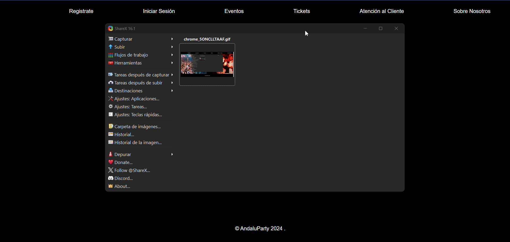
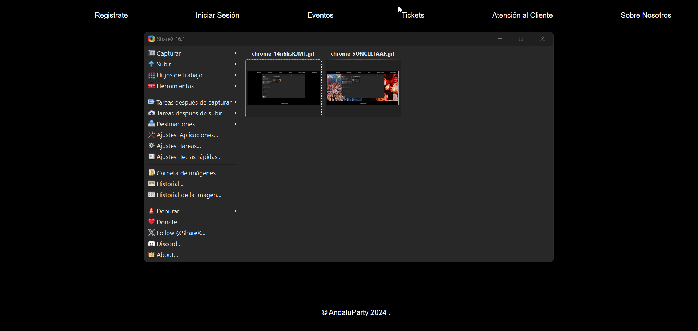
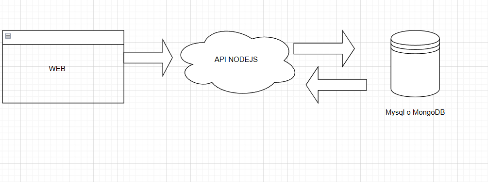
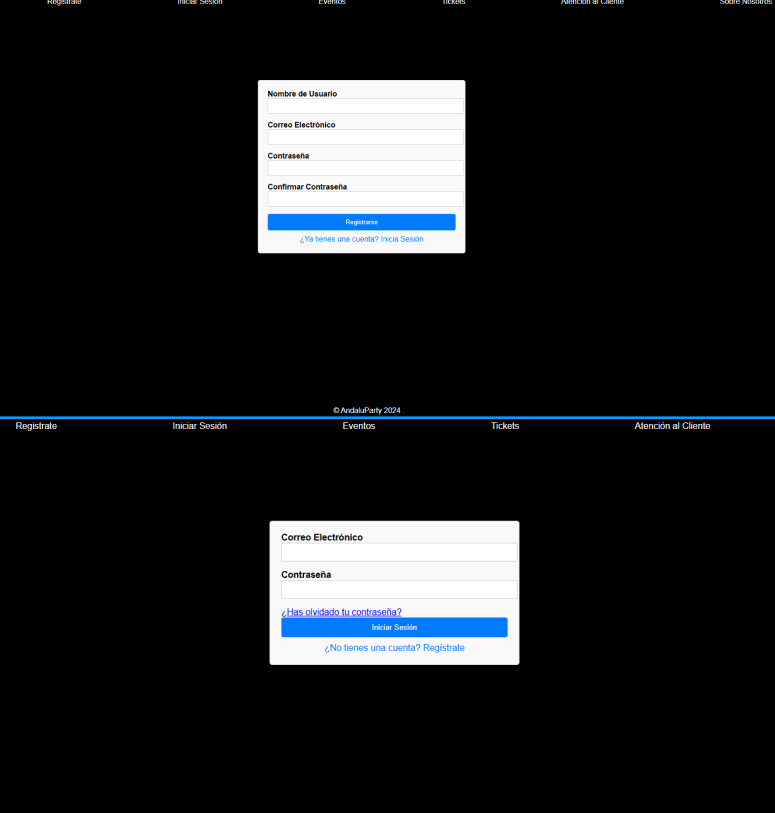
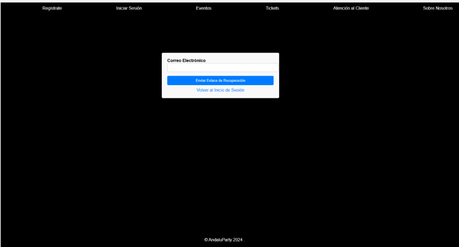

# Análisis del Problema

Se debe indicar en el directorio específico de la asignatura el problema que se va a resolver de una forma adecuada, es decir, no debe contener ambigüedades, debe ser simple y autocontenido.

# Diseño de la Propuesta de Solución del Problema

Como todo aquel problema que se quiere resolver, es necesario realizar el diseño de la o las soluciones que se procederá a implementar en el siguiente paso. Para esto nos debemos ayudar de las herramientas para realizar esquemas gráficos (UML, Diagramas de flujos, etc…).

# Implementación del Diseño Propuesto

En este punto ya se procederá a implementar todo el diseño establecido en el punto anterior.

# Pruebas de la Resolución del Problema

Es indispensable el realizar pruebas para verificar la integridad y correcto funcionamiento de la implementación realizada, para ello simplemente compararemos si el comportamiento esperado del análisis del problema se ha implementado de forma adecuada.

## Ejercicio 1: Implementación de la Pantalla de Inicio (Home)

### 🎯 Contexto

Desarrollar una Pantalla de Inicio funcional, adaptable y estéticamente atractiva, con los elementos mínimos requeridos según la categoría del proyecto seleccionada.

### ⚙️ Elementos Mínimos Independientes de la Categoría

1. 🔝 Barra de Navegación (Navbar)
2. 🖼️ Sección Principal (Hero Section)
3. 📄 Listado Dinámico de Contenido (Content List)
4. 📄 Detalle Resumido del Contenido (Content Card)
5. 📝 Pie de Página (Footer)

### ⚙️ Elementos Específicos

1. Barra de Filtros Avanzados (ProductFilter.jsx)
   - Filtros por categoría, precio, marca y valoración.
2. Tarjetas de Producto (ProductCard.jsx)
   - Es el uso del “ContentCard.jsx” pero para unos de datos concretos.
   - Imagen del producto, nombre, precio y botón Añadir al carrito, Abrir Chat o Abrir Configurador.
3. Resumen de Carrito (CartPreview.jsx), Chat de Venta o Pantalla del Configurador
   - Icono de carrito con resumen de productos añadidos.

### Prueba: Comprobación de Elementos Mínimos y Específicos

1. Navegar a la pantalla de Home.
2. Comprobar que aparecen los elementos mínimos y específicos definidos anteriormente con el detalle descrito en los diferentes enumerados.

### ✅ Prueba 1: Inicio de Sesión Correcto

1. Ingresar un correo y contraseña válidos.
2. Hacer clic en Iniciar Sesión.
3. Verificar que el usuario es redirigido al panel principal.
4. Confirmar notificación de éxito.
5. **Crear un GIF** mostrando que la función se realiza de forma correcta.
 

### ❌ Prueba 2: Error en Inicio de Sesión

1. Ingresar credenciales incorrectas.
2. Verificar que aparece una notificación de error.
3. **Crear un GIF** mostrando que la función se realiza de forma correcta.

 

### 🆕 Prueba 3: Registro con Validaciones

1. Ingresar datos inválidos (correo incorrecto, contraseñas que no coinciden).
2. Verificar que se muestran mensajes de error en tiempo real.
3. Corregir los datos y completar el registro.
4. Verificar notificación de éxito y redirección al login.
5. **Crear un GIF** mostrando que la función se realiza de forma correcta.
 

### 🔐 Prueba 4: Recuperación de Contraseña

1. Ingresar un correo registrado.
2. Verificar que se envía un aviso de correo de recuperación enviado.
3. Probar con un correo no registrado y verificar el mensaje de error.
4. **Crear un GIF** mostrando que la función se realiza de forma correcta.
 

